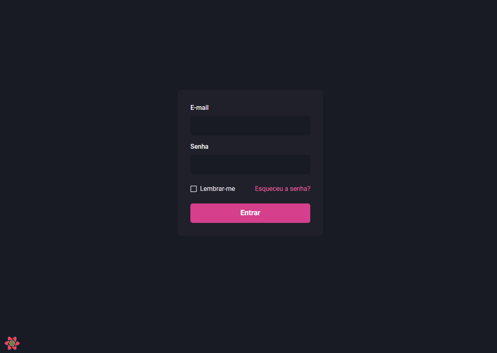
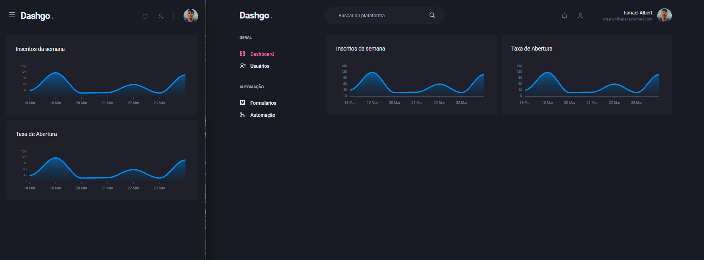
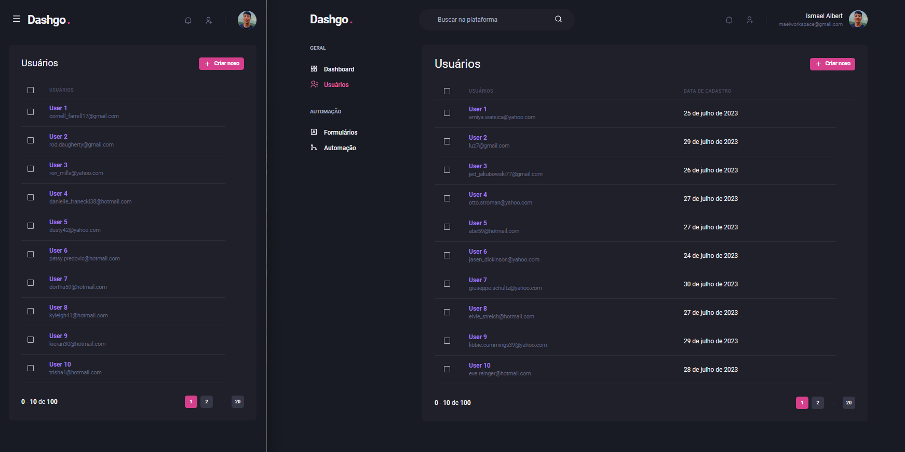

## 📖 Sobre

Dashgo é um dashboard administrativo responsivo, desenvolvido durante o curso Ignite da Rocketseat.

### Tecnologias utilizadas

- Next.js
- TypeScript
- Chakra UI
- Apexcharts.js
- React Hook Form
- Yup
- React Query
- Mirage JS
- Faker

## Imagens

|                             Tela de Login                             |
| :-------------------------------------------------------------------: |
|  |

|                               Dashboard                               |
| :-------------------------------------------------------------------: |
|  |

|                             Usuários                             |
| :--------------------------------------------------------------: |
|  |

|                             Criar Usuário                              |
| :--------------------------------------------------------------------: |
|  |

